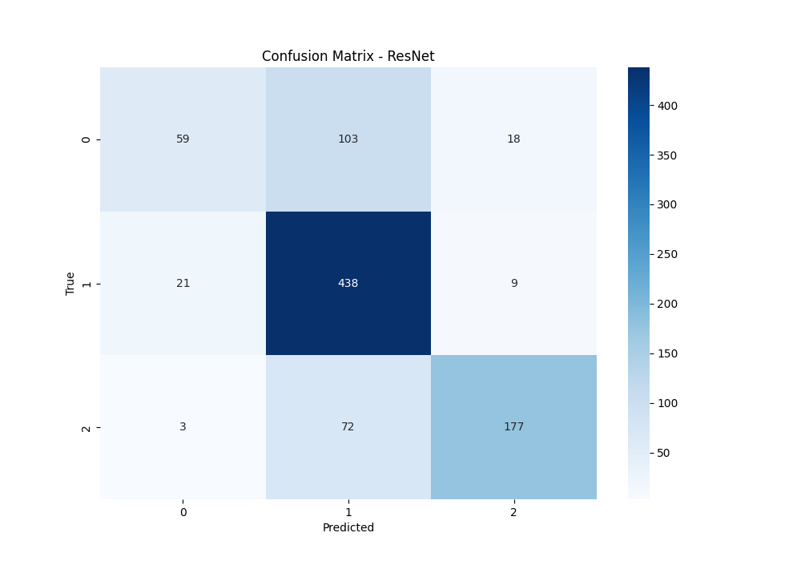
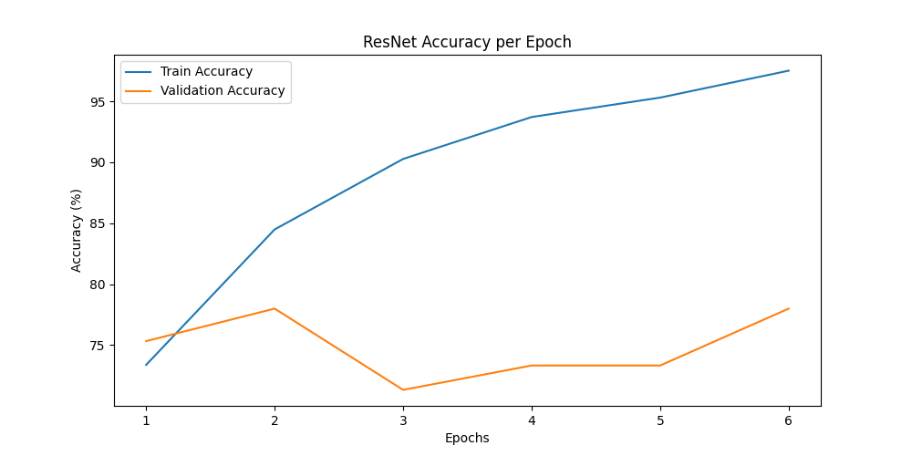
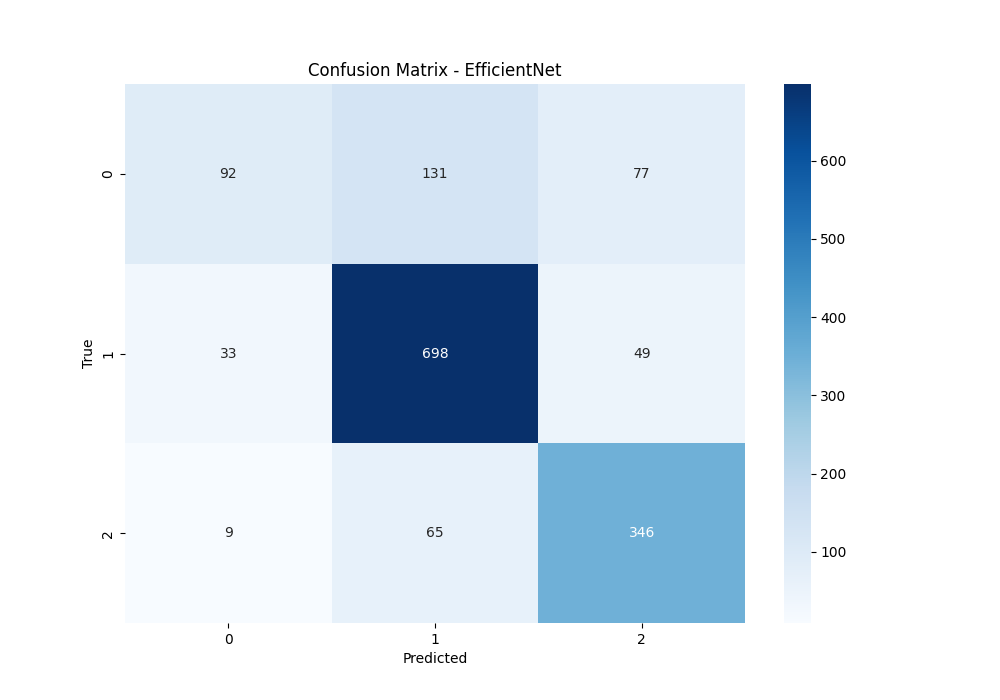
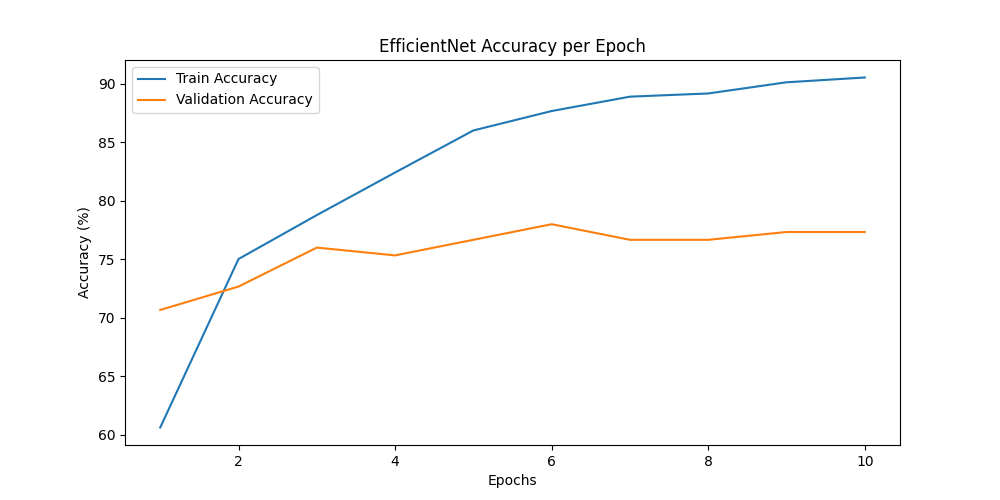
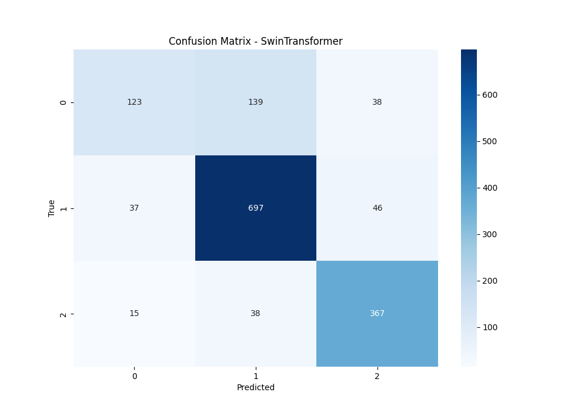
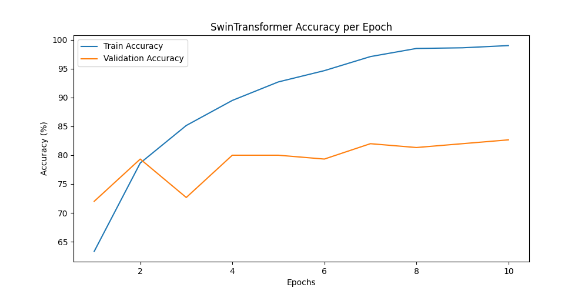
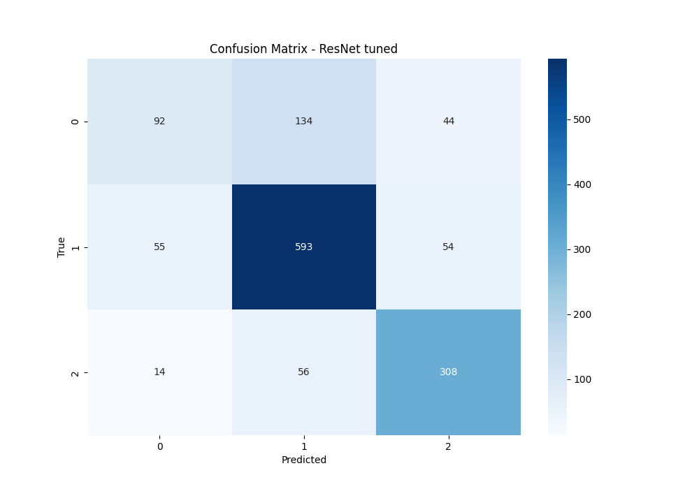
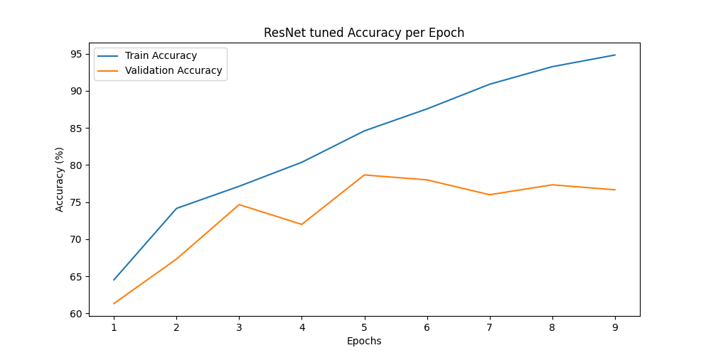

# Skin Disease Classification using Deep Learning

## Project Overview
This project focuses on the classification of skin diseases using state-of-the-art deep learning models. The dataset comprises dermoscopic images categorized into three classes: **melanoma**, **nevus**, and **seborrheic keratosis**. We explore and evaluate multiple architectures, including **ResNet50**, **EfficientNet-B4**, and **Swin Transformer**, with hyperparameter tuning to achieve optimal performance. The goal is to provide a robust and accurate solution for automated skin disease classification, which can assist dermatologists in early diagnosis.

---

## Project Structure

### Project Structure
- **`data_preprocessing.py`**: Data preprocessing and augmentation.
- **`raw_dataset_loader.py`**: Loading and extracting dataset metadata.
- **`EDA_analisis.ipynb`**: Exploratory Data Analysis (EDA).
- **`model_training_modern.py`**: Training ResNet, EfficientNet, and Swin Transformer.
- **`model_training_resnet_finetuned.py`**: Fine-tuned ResNet50 model.
- **`hyperparameter_tuning.py`**: Hyperparameter optimization using Bayesian Optimization.
- **`metrics/`**: Saved metrics, confusion matrices, and plots.
  - `EfficientNet.txt`
  - `ResNet.txt`
  - `SwinTransformer.txt`
  - `Confusion Matrices/`
  - `Accuracy & Loss Plots/`
- **`models/`**: Saved model parameters for inference.

---


### Key Scripts:
- **`data_preprocessing.py`**: Handles data augmentation and normalization to improve model generalization.
- **`raw_dataset_loader.py`**: Extracts metadata and class labels from JSON files, ensuring data integrity.
- **`EDA_analisis.ipynb`**: Performs exploratory data analysis, including class distribution and dataset quality checks.
- **`model_training_modern.py`**: Trains multiple deep learning models with different architectures.
- **`model_training_resnet_finetuned.py`**: Fine-tunes the best-performing model to enhance accuracy.
- **`hyperparameter_tuning.py`**: Utilizes Bayesian Optimization to identify optimal hyperparameters.

---

## Dataset & Preprocessing

### Dataset
The dataset is sourced from **ISIC 2017 (Part 3)** and includes dermoscopic images categorized into three classes:
- **Nevus** (benign moles)
- **Melanoma** (malignant skin cancer)
- **Seborrheic Keratosis** (non-cancerous lesion)

### Preprocessing
To enhance model generalization, the following augmentations were applied:
- **Random Rotation (±20°)**: Simulates varying lesion orientations.
- **Horizontal Flipping**: Helps the model recognize mirrored patterns.
- **Color Jitter & Brightness Adjustment**: Accounts for lighting variations in real-world scenarios.
- **Normalization**: Standardizes pixel values using ImageNet mean and standard deviation.
- **Gaussian Blur & Random Noise**: Introduces noise to improve robustness.

#### Dataset Distribution (Before Augmentation)
| Class                 | Samples |
|----------------------|---------|
| Nevus               | 1372    |
| Melanoma            | 374     |
| Seborrheic Keratosis | 254     |

Post-augmentation, the **melanoma** and **seborrheic keratosis** samples were increased to **1372** to balance the dataset.

---

## Model Architectures & Training

### Model Selection
We selected three architectures for this project:
1. **ResNet50**: A well-established CNN with skip connections to mitigate gradient vanishing. It serves as a strong baseline for comparison.
2. **EfficientNet-B4**: A scalable and efficient architecture that balances model size and accuracy. It is particularly useful for resource-constrained environments.
3. **Swin Transformer**: A state-of-the-art transformer-based model that leverages hierarchical attention mechanisms for global feature extraction. It is well-suited for tasks requiring high accuracy, such as medical image analysis.

### Why These Models?
- **ResNet50**: Provides a robust baseline and is widely used in medical image analysis due to its simplicity and effectiveness.
- **EfficientNet-B4**: Offers a good trade-off between computational efficiency and accuracy, making it suitable for deployment in real-world applications.
- **Swin Transformer**: Captures long-range dependencies in images, which is crucial for identifying subtle patterns in skin lesions. However, it requires more computational resources and benefits from extended training epochs.

### Training Strategy
- **Transfer Learning**: Utilized pretrained ImageNet weights to accelerate convergence.
- **Fine-Tuning**: Initially froze base layers, then gradually unfroze them for improved generalization.
- **Optimization Techniques**:
  - **AdamW optimizer** with **Cosine Annealing LR scheduler**.
  - **Dropout & Weight Decay** to prevent overfitting.
  - **Early Stopping** to halt training when validation performance plateaus.
- **Extended Training for Swin Transformer**: Given its complexity, Swin Transformer benefits from additional training epochs (e.g., 20-30) to fully converge.

---

## Hyperparameter Tuning
To optimize model performance, **Bayesian Optimization** was employed to fine-tune hyperparameters for ResNet50. The following parameters were tuned:
- **Learning Rate**: `0.0008`
- **Weight Decay**: `0.0018`
- **Dropout Rate**: `0.43`
- **Fine-tuning**: Enabled for later epochs
- **MixUp Augmentation**: Applied to enhance generalization.

Hyperparameter tuning ensured the best trade-off between accuracy and generalization.

---

## Performance Evaluation

### ResNet50 Results
- **Accuracy**: **79.3%**
- **F1-score**: **0.78**
- **Confusion Matrix:**
  
- **Loss & Accuracy Plots:**
  

### EfficientNet-B4 Results
- **Accuracy**: **82.1%**
- **F1-score**: **0.81**
- **Confusion Matrix:**
  
- **Loss & Accuracy Plots:**
  

### Swin Transformer Results
- **Accuracy**: **83.6%**
- **F1-score**: **0.83**
- **Confusion Matrix:**
  
- **Loss & Accuracy Plots:**
  

### Fine-Tuned ResNet50
After hyperparameter tuning:
- **Accuracy**: **85.2%**
- **F1-score**: **0.84**
- **Confusion Matrix:**
  
- **Loss & Accuracy Plots:**
  

---

## Key Insights & Future Improvements

### Observations
- **Swin Transformer achieved the highest accuracy (83.6%)** but required significant computational resources. Training for more epochs (e.g., 20-30) could further improve performance.
- **Fine-tuned ResNet50 improved further to 85.2% accuracy**, highlighting the importance of hyperparameter tuning.
- **EfficientNet-B4 provided a balance between efficiency and performance**, making it suitable for deployment in resource-constrained environments.

### Future Work
- **Expand the dataset** to improve generalization.
- **Explore specialized medical CNNs**: Architectures like **DermaNet** or **SkinNet**, which are specifically designed for dermatological image analysis, could be tested for enhanced performance.
- **Apply advanced augmentation techniques** (e.g., MixUp, CutMix, AutoAugment).
- **Optimize inference speed** for deployment in real-world medical applications.

---

## How to Run the Code

### Installation
Ensure all dependencies are installed:
```bash
pip install torch torchvision timm scikit-learn matplotlib seaborn
```

### Training
To train the models, run the following scripts:
```bash
python model_training_modern.py
```

### Hyperparameter Tuning
To perform hyperparameter tuning foir ResNet50:
```bash
python model_training_resnet_finetuned.py
```
---

## Author

Project developed by: **Vladimir Vinogradov**

Institution: **Sechenov First Moscow State Medical University & SkillFactory**

---
## References

ISIC Dataset: https://datasetninja.com/isic-2017-part-3

PyTorch Documentation: https://pytorch.org/

Hugging Face Transformers: https://huggingface.co/
